<!-- ══════════════════════════════════════════════════════════════
     denislibs · profile README
     Header art: ./assets/header.svg  (custom animated SVG — keep the path intact)
     ══════════════════════════════════════════════════════════════ -->

<div align="center">



<br/>

<!-- animated typing line -->
<a href="https://github.com/denislibs">
  
</a>

</div>

---

I build fine-grained reactive interfaces and small, sharp libraries. My flagship
[**continuum**](https://github.com/denislibs/continuum) is classic FRP — *Behaviors*
(values over time), *Events* (things that happen), and *transactions* — with pinpoint DOM
updates and no virtual-DOM re-renders, in under 8 kB for the whole stack. Currently at
**Documentolog** in Astana, Kazakhstan.

If it can be a stream, I'll probably make it a stream.

### Stack

**Languages**
&nbsp;


**Frontend**
&nbsp;&nbsp;&nbsp;&nbsp;


**Runtimes**
&nbsp;&nbsp;


### Featured work

<div align="center">

<a href="https://github.com/denislibs/continuum">
  
</a>
<a href="https://github.com/denislibs/prepare-to-front">
  
</a>

</div>

### The numbers

<div align="center">


<br/>


<!-- Optional contribution-snake. It only appears after you add the workflow below. -->
<br/>


</div>

### neofetch

```text
denislibs@astana ────────────────────────────
OS ............ macOS / Linux / Windows
Location ...... Astana, Kazakhstan
Focus ......... FRP · signals · tiny libs
Now ........... Documentolog

behavior ── continuous value over time
   events ── discrete things that happen
      → reactive UI, pinpoint updates, no re-renders
```

### Say hi

[](https://t.me/undefined_is_not_a_functionn)

<div align="center">
<sub><code>const undefined_is_not_a_function = () => "…usually";</code></sub>
</div>
